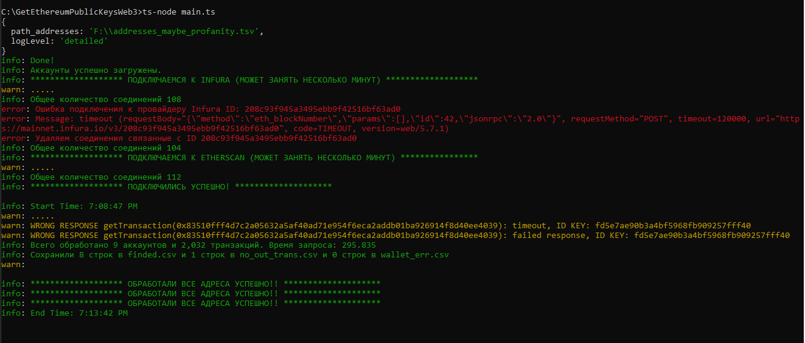

# Получение истории транзакций и текущего баланса (Etherscan), извлечение публичного ключа для списка адресов Ethereum.


## Файл config.json
Находится в папке src/config.
Имееет один параметр:
* ***"path_addresses"*** - путь к файлу с адресами Ethereum

## Описание
* Списки ключей etherscan и infura находятся в файле src/store/keys.ts. Для каждого ключа infura предусмотренны два дополнительных. Это сделано потому что у infura ограничение не по времени для запросов, а по их количеству. Поэтому, если в цикле запросов, получим ответ "daily request count exceeded"(лимит исчерпан) от сервера, подключаемся от запасных ключей для соответствующих акаунтов и продолжаем работу дальше.</br>
* В конструкторе класса Interface(interface.ts) для каждого ключа создаются 4 объекта ethers.providers(в классах ProviderHandle). Это сделано для того, чтоб сразу отправлять по 4 запроса от каждого аккаунта. Если их делать от одного объекта, ассинхронно отправить 4 запроса подряд, то почему-то получаем часто ответ от сервера "missing response". А если ассинхронно отправлять от четырех объектов одного ключа, то не получаем.</br>
* Из run()(dispether.ts) читаем config.json, загружаем список адресов из файла в объект tables класса Data.</br>
* Для всех созданных ethers.providers проверяем подключения. Посылаем запросы текущего номера блока, и если получили ошибку подключения, удаляем соответствующие аккаунты ethers.</br>
* Далее в snifferPubKeys() перебираем все адреса, создаем ассинхронно запросы для всех аккаунтов etherscan, и соответствующие аккаунты infura. Каждым аккаунтом etherscan запрашиваем историю соответствующего адреса, ищем там исходящие транзакции. Из хеша транзакции берем (provider.getTransaction()) саму транзакцию аккаунтом infura. Преобразовываем ее и изалекаем публичный ключ. Аккаунтом infura запрашиваем баланс адреса. И сохраняем полученные публичные ключи и балансы (в $USD) в файл Tables/finded.csv.</br>
* Если у адреса нет исходящих транзакций, следовательно мы не можем узнать публичный ключ, то сохраняем такие адреса с их балансами в Tables/no_out_trans.csv.</br>
* Если произошла какая-либо ошибка при запросах для определенного адреса, то сохраняем этот адрес и сообщение об ошибке в файл Tables/wallet_err.csv

## Первый запуск на ubuntu

* **Устанавливаем VS Code**
* **Устанавливаем typescript компилятор**
```bash
sudo apt install npm
sudo npm install -g typescript
```
* **Устанавливаем nodejs**
```bash
curl -o- https://raw.githubusercontent.com/nvm-sh/nvm/v0.38.0/install.sh | bash

source ~/.bashrc

nvm list-remote

nvm install v16.17.1
```
* **Проверка версии node.js**
```bash
node -v
```
* **Открываем папку с исходниками в vscode**</br>
Нажимаем F5 и запускаем в режиме отладки
* **Открываем папку с исходниками в терминале**
```bash
npx ts-node main.ts
```

### ОБСУЖДЕНИЕ КОДА: https://t.me/BRUTE_FORCE_CRYPTO_WALLET


